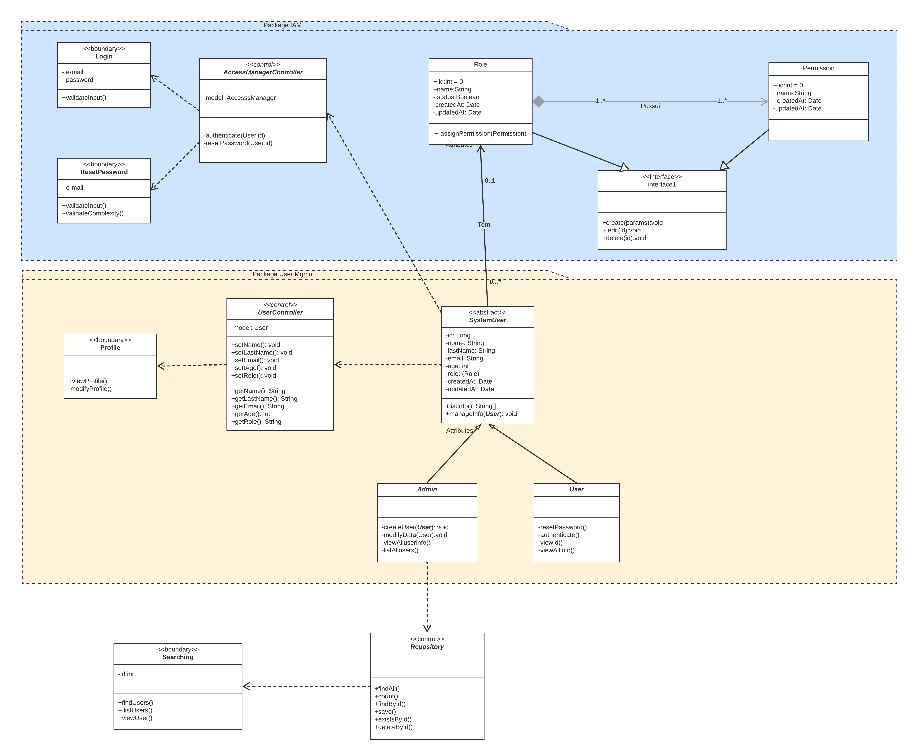
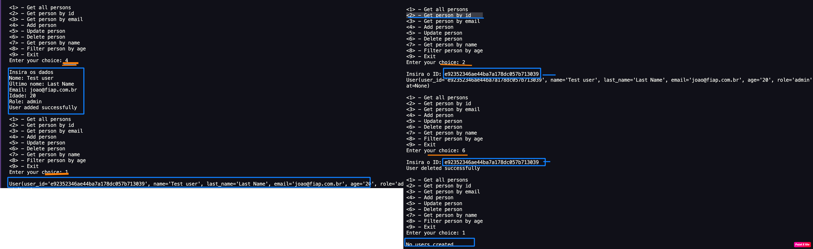

### Coding4Hope 

This project is the implemenation of the `entities` classes for the `Coding4Hope` system.

<p align="center">


----

<div align="center">

 **TEAM VOID**

```zsh
> Fernando Sitta - RM87177
> Jorge Mercado - RM89287
````

</div>

</p>

----
#### Executing the program in command line:

Run the python command
```
python3 main.py
```


Use the default user credentials created with "Admin" privileges.

`default@void.test`

`password: admin`


Switch the users and see the  differnt menu options for **Admin** and **Users** classes, child from **SystemUser**
----

For more details about the entities and relationships see the Diagram  and the [documentation.](/docs/index.html)  

<p align="center">


> See the execution 
<p align="center">

